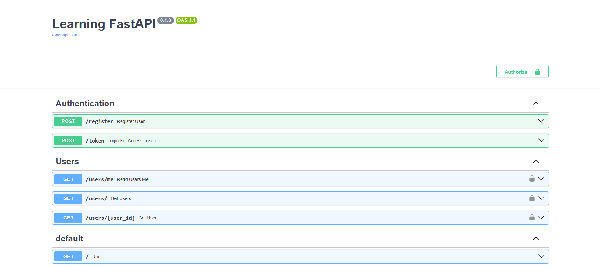

# FastAPI Authentication & User Management API

A **modular and clean** REST API built using FastAPI, SQLite, and SQLAlchemy, complete with secure JWT authentication, password hashing, and full User CRUD operations. The project architecture follows best practices by separating logic into dedicated modules for configuration, database, schemas, and routing.



---
## Features
* **Clean Architecture:** Logic is modularized into `core/`, `database/`, `schemas/`, and `routers/` for better maintainability and scalability.
* **User Authentication:** Secure login and registration using **OAuth2 (Password Flow)** and **JWT**.
* **Password Security:** Passwords are hashed using `pbkdf2_sha256` before storage.
* **Database Integration:** Fully integrated with SQLite using **SQLAlchemy ORM**.
* **CRUD Operations:** Full Create, Read, Update, and Delete capabilities for user management.
* **Dependency Injection:** Clean architecture using FastAPI's dependency injection system for database sessions and current user verification.

---
## Tech Stack
| Technology | Badge | Description |
|------------|--------|-------------|
| **Python 3.9+** |  | Core programming language used for the backend. |
| **FastAPI** |  | **High-performance API framework** with automatic documentation. |
| **SQLite** |  | Lightweight file-based database used for development. |
| **SQLAlchemy** |  | **Object-Relational Mapper (ORM)** for interacting with database models. |
| **Pydantic** |  | **Schema definition** for robust data validation. |
| **OAuth2** |  | Authentication scheme used for secure token access. |

---
## API Endpoints Overview
  
### Authentication

| Method | Endpoint       | Description                          |
|--------|----------------|--------------------------------------|
| POST   | `/register`      | Register a new user account.         |
| POST   | `/token`         | Login to receive an Access Token.    |
| GET    | `/verify-token`  | Check if your current token is valid.|

### User Management

All endpoints require a valid Access Token in the `Authorization: Bearer <token>` header.

| Method | Endpoint        | Description                               |
|--------|------------------|-------------------------------------------|
| GET    | `/users/me`      | Get details of the logged-in user.        |
| GET    | `/users/`          | List all users.           |
| GET    | `/users/{id}`      | Get a specific user by ID.                |
| POST   | `/users/`          | Create a new user (Requires Auth).       |
| PUT    | `/users/{id}`      | Update user details.                      |
| DELETE | `/users/{id}`      | Delete a user.                             |

---
## Folder Structure

The refactored project structure separates concerns into logical directories:

```text
.
├── app/
│   ├── main.py                  # Application entry point (initializes app and routers)
│   ├── dependencies.py          # Shared dependency injection logic (get_current_user)
│   ├── core/
│   │   ├── config.py            # Project settings, secrets, and constants
│   │   └── security.py          # Password hashing and JWT token creation/verification
│   ├── database/
│   │   ├── database.py          # SQLAlchemy engine and session setup
│   │   └── models.py            # SQLAlchemy ORM models (User table)
│   ├── routers/
│   │   ├── auth.py              # Endpoints for /register and /token
│   │   └── users.py             # Endpoints for /users CRUD operations
│   └── schemas/
│       └── user.py              # Pydantic models (UserCreate, UserResponse, Token, etc.)
├── test.db                      # SQLite Database (Auto-generated)
├── requirements.txt
└── ... (other files)
```

---
## Installation
### 1. Clone the repository
```bash
[https://github.com/HaiqalAly/Learn-CRUD-FastAPI](https://github.com/HaiqalAly/Learn-CRUD-FastAPI)
```

### 2. Create a Virtual Environtment
# Windows
```bash
python -m venv .venv
.venv\Scripts\activate

# Mac/Linux
python3 -m venv .venv
source .venv/bin/activate
```

### 3. Install dependencies
```bash
pip install -r requirements.txt
```

### 4. Run the Application
```bash
uvicorn app.main:app --reload
```

### 5. Access the API
- API Root: http://127.0.0.1:8000
- Interactive Docs (Swagger UI): http://127.0.0.1:8000/docs

### 6. Register and Login
- To gain access, you must first register (/register) and then login (/token).
- Use your email as the username and your password to get the Access Token.
- Copy the access token, click Authorize in the Swagger UI, select the `OAuth2PasswordBearer`, and paste the token into the Value field, prepending it with `Bearer` (e.g., `Bearer eyJhbGciOiJIUzI1Ni...`).

---
## License
This project is licensed under the MIT License.  
You are free to use, modify, and distribute this project for learning or development purposes.
